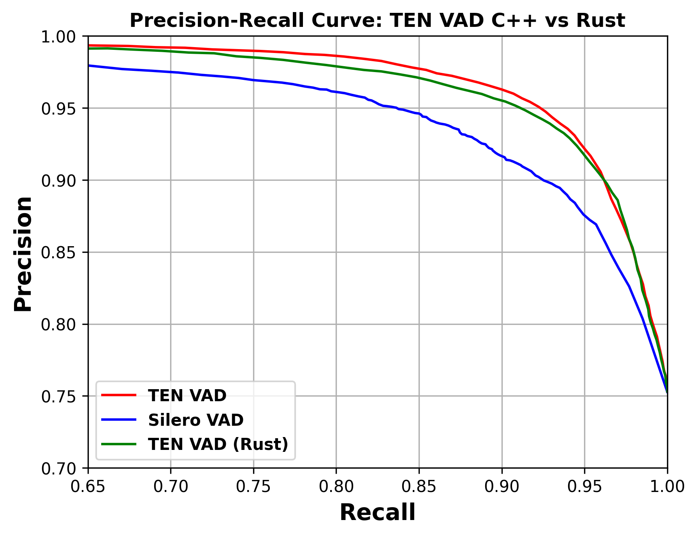

# 🎤 ten-vad-rs

[](https://crates.io/crates/ten-vad-rs)
[](https://docs.rs/ten-vad-rs)
[](./LICENSE)

A Rust library for working with the [TEN VAD (Voice Activity Detector)](https://github.com/TEN-framework/ten-vad) ONNX model. A low-latency, high-performance and lightweight solution to detect speech in audio streams. 🚀

## ✨ Features
- 🎙️ Real-time voice activity detection
- 🦀 Pure Rust API
- 🧠 Powered by ONNX Runtime
- 📦 Easy integration into your audio projects
- 🛠️ Example code for microphone and WAV file VAD

## 📦 Installation
Add to your `Cargo.toml`:

```toml
[dependencies]
ten-vad-rs = "0.1.5" # Replace with the latest version
```

## 🚀 Quick Start
Here's a simple example using a WAV file:

```rust
use ten_vad_rs::TenVad;

let mut vad = TenVad::new("onnx/ten-vad.onnx", 16000).unwrap();
let audio_frame = vec![0i16; 256]; // 16-bit PCM audio samples in 16kHz
let vad_score = vad.process_frame(&audio_frame).unwrap();
```

See the [`examples/`](examples/) directory for more advanced usage:
- `wav_file_vad.rs` — Run VAD on a WAV file
- `microphone_vad.rs` — Real-time VAD from microphone
- `pr_curve.rs` — Compute precision-recall curves on the TEN-VAD TestSet

## 📊 PR Curve Evaluation

Generate precision-recall data using the Rust example. The ten-vad repository is required for test set files.
```sh
cargo run --example pr_curve -- ten-vad/testset onnx/ten-vad.onnx
```

This produces `PR_data_TEN_VAD_RS.txt` with threshold / precision / recall rows.
The data can be compared to the base ten-vad implementation's PR curve results.





## 🛠️ Building
Requires Rust and a working ONNX Runtime environment. Build with:

```sh
cargo build --release
```

## 🤝 Contributing
Contributions, issues, and feature requests are welcome! Feel free to open an [issue](https://github.com/wangfu91/ten-vad-rs/issues) or submit a pull request.

## 📄 License
Licensed under the [Apache-2.0](./LICENSE) license.

